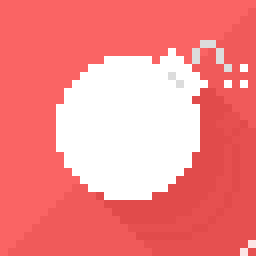
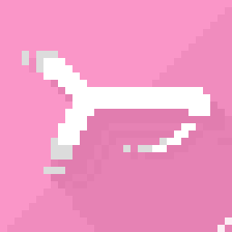
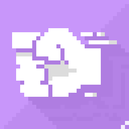
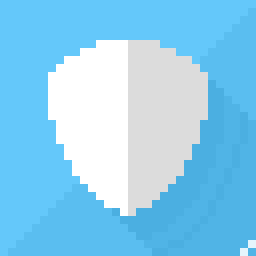
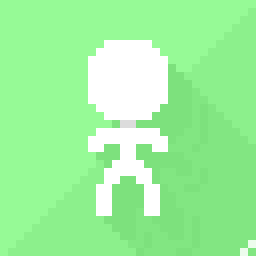

# ministick. 


An addictive, infinite and super-fast beat-them all. 
Let's see how far you can go ! 

## LAUNCH THE GAME 🎮
You must have [**Java 13**](https://www.oracle.com/java/technologies/javase/jdk13-archive-downloads.html) 
installed to play the game.

#### WINDOWS
- Click on `launch.bat`

#### LINUX
- Execute `./launch.sh`

...or place yourself in the root directory,
open a terminal and launch the command:
```bash
java -jar ministick.jar
```

## HOW TO PLAY 🕹

#### 🏃 Move
`⬅` / `Q` : **walk** left  
`➡` / `D` : **walk** right  
`⬆` / `Z` : **jump**  
`⬇` / `S` : **squat**

`⬅` + `⬅` : **dash** left  
`➡` + `➡` : **dash** right  
`⬇` + `⬇` : **drop** from platform  
`SHIFT` + `⬅` / `⬆` / `➡` / `⬇` : **camera** mode


#### 💥 Attack

`C` / `L` : **punch** (or **throw** item)  
`V` / `M` : **kick**  
`F` : **parry**  

`⬆` + `kick` : **airkick**  
`⬇` + `kick` : **sweeper**  
`⬆` + `punch` : **air uppercut**  
`⬇` + `punch` : **uppercut**  

#### ⚙ General
`M` : enable/disable **sound**  
`H` : display **hitboxes**  
`K` : display **keyboard**  
`B` : display **background**  

`P` : **pause** the game  
`A` : **exit** the game


---

## BONUS ⏹️
| Name | | Power |  
|---:|:---:|:---|   
| BOMB     |          | Inflicts 25 damage to **every enemy** on the stage
| HEALTH   |      | **Heals** 10 HP
| KICK     |          | Boosts **kick** damage. Also grants a speed boost
| PUNCH    |        | Boosts **punch** damage
| SHURIKEN |  | Gives 5 throwable **shurikens**
| SHIELD   |      | Grants **invincibility** during a few seconds
| FREEZE   |      | The stage becomes **twice as low** during a few seconds
| SIDEKICK |  | Summons a **sidekick** who will fight enemies with you
| *???* | ? | *(Coming soon !)*

### TIPS 💡

- Try to evaluate the **direction** and **distance** of each attack to make **smart attack sequences**. 
  Some moves are **specifically designed** to work with each other !

- Displaying the hitboxes may help to understand the **range** of some moves. 

- ***Avoid spamming***. Making the same move **three times in a row** cancels the combo.

- Jump on **platforms** so enemies struggle to follow you !

- Don't forget to **parry** to avoid being stun for too long and take **too many hits** in a row.


